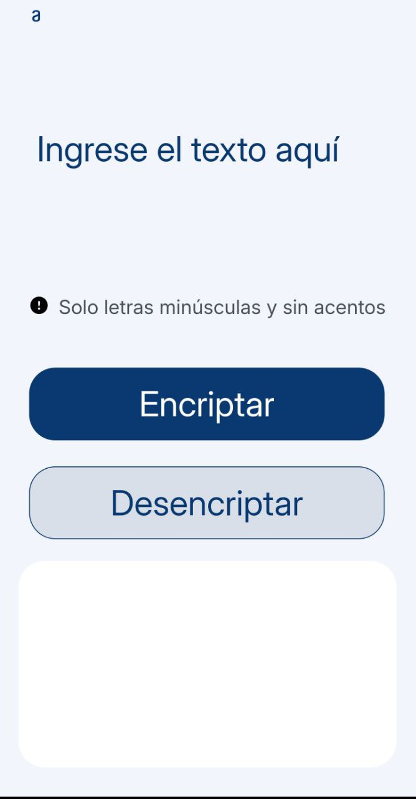
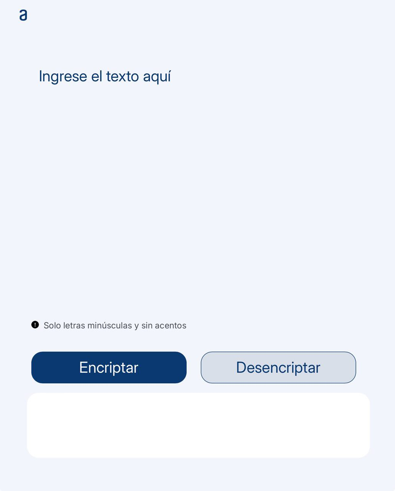

<h1 align="center"> The CypherPunk decoder: Encriptador de texto</h1>

<h2>Tecnologías empleadas</h2>

  

<h2>¿Qué es 'CypherPunk Decoder'?</h2>
Se trata de un sencillo proyecto web en desarrollo que nos permite cifrar texto de acuerdo a una serie de criterios establecidos para hacer ilegible dicho texto.

<h3>🔨 Parámetros del cifrado de texto:</h3>

Las "llaves" de encriptación que utilizamos son las siguientes:

* La letra "e" es convertida para "enter"

* La letra "i" es convertida para "imes"

* La letra "a" es convertida para "ai"

* La letra "o" es convertida para "ober"

* La letra "u" es convertida para "ufat"

<h3>⚠️ Limitaciones del programa:</h3>

* El programa solo funcionará con minúsculas. Cualquier intento de introducir caracteres en mayúscula tendrá como resultado una encriptación nula. Es decir, obtendremos en la ventana de resultado el mismo caracter sin cifrar.

* Evitar usar letras con acentos ni caracteres especiales ya que estos no serán tomados en cuenta por el programa para su cifrado y se imprimirán tal cual en la ventana de resultado. 

<h2>Uso de la aplicación</h2>
La página tiene un campo para inserción del texto que será encriptado o desencriptado. El usuario puede elegir si quiere "encriptar" o "desencriptar" el texto usando los respectivos botones para ello.

#

Un botón de "Copiar" el mensaje encriptado/desencriptado aparecerá luego de procesar el texto. Esto nos permite copiar al portapapeles el resultado exacto del cifrado o descifrado del texto que introducimos

<h3>Versión web móvil</h3>
El proyecto se encuentra optimizado en su apartado gráfico para adaptarse a la pantalla de dispositivos móviles como teléfonos y tablets:

#
<h4>Versión web para teléfonos</h4>

<h4>Versión web para tablets</h4>

<h2>Contacto</h2>
Puedes contactarme por los siguientes canales: 

* <label>LinkedIn: <a href="https://www.linkedin.com/feed/">Alfredo Velez<a></label>
* <label>alfredojvp@hotmail.com</label>

<h2>Licencia</h2>
CypherPunk Decoder es un programa con <a href="https://github.com/alfredojvp/Encriptador-Texto-Challenge/blob/main/LICENSE">licencia MIT</a> que garantiza su libertad de uso y reproducción.